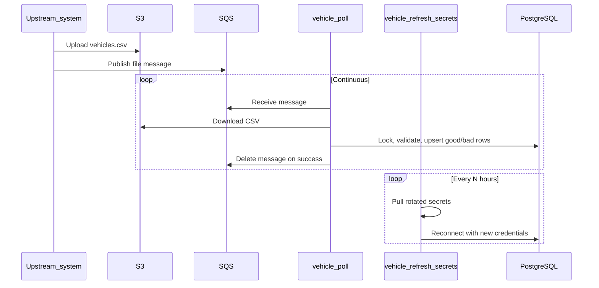

# Vehicle Data Handler (Laravel)

A background service that ingests vehicle data CSV files
referenced by queue messages, validates each row, and persists valid records to
a database while quarantining invalid rows for inspection.

This repository is a **complete, runnable Laravel 12 project** (framework
skeleton + application code, config, migrations, sample data, and a PHPUnit test
suite). Install dependencies with Composer and run it directly. Production
targets PostgreSQL; local development and the test suite use SQLite. See
[Setup](#setup).

---

## 1. Functional overview

The service continuously polls a **queue**. Each message names a **file** (bucket
+ folder + file name) to process. For each message the service:

1. **Acquires a file lock** — a row in `file_processing_locks` keyed by file
   name and owned by this instance (`locked_by` = EC2 instance id). If another
   *live* instance already holds the lock, the file is skipped. Locks left
   behind by a dead instance (older than a stale timeout) are reclaimed.
2. **Downloads the CSV** from the file store (S3 in production, local disk in
   dev/test).
3. **Parses and validates** every row. A row is rejected if it has the wrong
   column count, an invalid VIN, an out-of-range or non-integer model year, a
   negative/non-numeric price, non-boolean flags, missing required fields, or
   malformed features JSON. All problems in a row are reported together.
4. **Processes rows in batches** equal to the configured *max degree of
   parallelism* (default 10). Within a batch, rows are parse-validated
   (optionally in parallel) and then **valid + invalid rows are written in a
   single database transaction** — the unit-of-work batch commit.
   - Valid rows → `vehicle_data` (upserted by VIN).
   - Invalid rows → `bad_vehicle_data` with the failure reason.
5. **Advances the lock's `last_processed_at`** after each committed batch, then
   marks the lock `completed` (or `failed`) and acknowledges the message.

A second background service periodically **refreshes secrets** (bucket name,
queue URL, DB connection string) and **rebuilds the database connection** so a
long-lived process survives credential rotation. This loop is toggled by a
config flag so it can be disabled during testing.

### Idle backoff

While the queue is empty the poller waits `polling.interval_seconds` between
receives. Once it has been continuously empty for
`polling.empty_poll_threshold_seconds` (default 60s), it sleeps for
`polling.backoff_sleep_seconds` (default 300s) before resuming. Any received
message resets the idle timer.

### Vehicle record schema

The CSV has 20 columns (in this order). Derived VIN fields are computed, not
read from the file.

| Column                | Rules                                                                 |
|-----------------------|-----------------------------------------------------------------------|
| `vin`                 | 17 chars, alphanumeric, excludes I/O/Q, **valid ISO 3779 check digit**; unique |
| `model`               | required                                                              |
| `model_year`          | integer, 1900 … current year + 1                                      |
| `trim`                | optional                                                              |
| `body_style`          | enum: sedan, suv, truck, coupe, hatchback, van, wagon, convertible    |
| `current_price_usd`   | non-negative number                                                   |
| `msrp_usd`            | non-negative number                                                   |
| `carfax_certified`    | boolean                                                               |
| `pincode`             | required (dealership)                                                 |
| `is_new`              | required, non-null boolean                                            |
| `mileage`             | non-negative integer                                                  |
| `previous_owners`     | non-negative integer                                                  |
| `exterior_color`      | required                                                              |
| `interior_color`      | required                                                              |
| `engine_type`         | enum: gasoline, diesel, hybrid, electric                              |
| `transmission`        | enum: automatic, manual, cvt                                          |
| `fuel_efficiency_mpg` | positive number; **required unless** `engine_type` = electric         |
| `manufacture_date`    | required, `YYYY-MM-DD`, not in the future                             |
| `registration_date`   | optional, `YYYY-MM-DD`, not before `manufacture_date`                 |
| `features`            | JSON object; `airbags` (int) required; `sunroof`/`headlamps`/`driverAssist` type-checked if present |

Derived and stored automatically: `wmi` (first 3 VIN chars), `vin_region`,
`vin_country` (decoded from the VIN), and `last_updated` (set when the file is
processed).

**Cross-field rules:** `model_year` must equal the manufacture year or the year
after; a `is_new` vehicle must have zero previous owners and at most 100 miles;
`registration_date` cannot precede `manufacture_date`.

---

## 2. Technical architecture

Every external dependency sits behind an interface, selected by config at the
composition root (`App\Providers\VehicleHandlerServiceProvider`). This is what
makes the app testable locally with no AWS account.

| Concern              | Interface                     | Local / dev impl              | Production impl             |
|----------------------|-------------------------------|-------------------------------|-----------------------------|
| Queue                | `QueueServiceInterface`       | `LocalQueueService` (files)   | `SqsQueueService`           |
| File store           | `FileStorageServiceInterface` | `LocalFileStorageService`     | `S3FileStorageService`      |
| Secrets              | `SecretsProviderInterface`    | `EnvSecretsProvider`          | `AwsSecretsProvider`        |
| Row processing       | `RecordProcessorInterface`    | `AmpRecordProcessor` (amphp/parallel) | `AmpRecordProcessor` (amphp/parallel) |

Key components:

- **`PollQueueCommand`** (`vehicle:poll`) — the poller "hosted service":
  receive loop, adaptive backoff, graceful shutdown, lock-skip handling.
- **`RefreshSecretsCommand`** (`vehicle:refresh-secrets`) — the secrets-refresh
  "hosted service": refresh + DB reconnect on an interval, gated by
  `secrets.enable_refresh`.
- **`VehicleFileProcessor`** — orchestrates lock → download → parse → batch
  process → transactional commit → release.
- **`FileLockManager`** — pessimistic, row-level distributed lock with stale
  reclamation; keyed on the instance id.
- **`VehicleRecordValidator`** — pure, framework-free, fully unit-testable
  validation producing a typed `VehicleRecord` or a list of reasons.
- **`VinDecoder`** (`app/Support`) — ISO 3779 check-digit validation and WMI
  region/country decoding; pure and framework-free.
- **Enums** (`app/Enums`) — `BodyStyle`, `EngineType`, `TransmissionType` as
  backed enums used by both validation and persistence.
- **DTOs** (`QueueMessage`, `VehicleRecord`, `BadVehicleRow`, `RowOutcome`) —
  immutable, serializable value objects that cross the async worker boundary
  safely.

### Concurrency & transactions — the important design note

Processing uses **amphp/parallel**, whose worker pool runs at most
`max_degree_of_parallelism` tasks concurrently. Task inputs and return values
are **serialized across the worker boundary**, so a worker cannot share the
parent's database transaction. The workers therefore do **CPU-bound work only**
(parse + validate — including the ISO 3779 VIN check-digit computation, WMI
decoding, date parsing and cross-field rules) and return plain serializable
DTOs. The **parent** then writes each batch in a single `DB::transaction()`.
This preserves the "N vehicles committed as one transaction" guarantee while
parallelising the expensive validation work.

amphp/parallel uses **process-based workers by default**, which require no PHP
extensions and run on Linux, macOS **and Windows**. Installing a ZTS PHP 8.2+
build with `ext-parallel` transparently upgrades workers to native threads with
no code change. The worker pool is created once and reused for the lifetime of
the poller process, and is shut down cleanly when the poller stops.

### Why no HTTP routes or authentication?

This is a CLI background worker, not a web API. Work enters exclusively via SQS
messages. All access control is handled at the AWS infrastructure layer: IAM
instance profiles restrict which EC2 instances can read the SQS queue, access
S3, and retrieve secrets. Database access is secured via VPC/security groups and
rotated credentials from Secrets Manager. There is no user-facing surface that
would require application-level authentication, middleware, or HTTP routing. The
optional `GET /up` health endpoint is a framework built-in for load-balancer
checks, not application functionality.

### Windows note

Parallel processing works natively on Windows because amphp/parallel uses
process-based workers (no `ext-pcntl` needed). The only feature that requires
`ext-pcntl` is **signal-based** graceful shutdown of the poller; on native
Windows that handler is skipped, so stop the poller with Ctrl+C. Everything
else — including true parallel processing — runs identically.

---

## 3. Setup

### Prerequisites

- PHP 8.2+ with extensions: `mbstring`, `pdo_sqlite` (or `pdo_pgsql`/`pdo_mysql`),
  `json`, `openssl`.
- Composer.
- (Optional) `ext-pcntl` on Linux/macOS/WSL — only for signal-based graceful
  shutdown of the poller. Parallel processing does **not** require it.

### Steps

```bash
# 1. Install dependencies (pulls Laravel + league/csv, aws-sdk, amphp/parallel)
composer install

# 2. Environment
cp .env.example .env             # Windows PowerShell: copy .env.example .env
php artisan key:generate

# 3. SQLite database (zero-setup local default)
touch database/database.sqlite   # Windows PowerShell: New-Item database/database.sqlite

# 4. Run migrations
php artisan migrate
```

The service provider is already registered in `bootstrap/providers.php`, and the
extra Composer packages are declared in `composer.json` (see also
`composer-requirements.txt` for a description of each).

---

## 4. Running it locally

The local drivers need no AWS. Sample CSVs live under
`storage/app/incoming/local-bucket/` — the local file store maps a "bucket" to a
sub-directory of the incoming path, so messages should use `"bucket":"local-bucket"`.

To exercise the poll loop manually, drop a queue message JSON file into
`storage/app/queue/` (this is what upstream does via SQS in production):

```bash
# Example message for vehicles_valid.csv
echo '{"bucket":"local-bucket","folderPath":"","fileName":"vehicles_valid.csv"}' \
  > storage/app/queue/manual-test.json

# Process one receive cycle then exit (best for a quick check)
php artisan vehicle:poll --once

# Or run the continuous poller (Ctrl+C to stop)
php artisan vehicle:poll
```

For automated verification, prefer the test suite — it enqueues work via an
in-memory `QueueServiceInterface` double (`Tests\Support\InMemoryQueueService`)
bound in `tests/TestCase.php`, not via an artisan helper.

Then inspect results:

```bash
php artisan tinker
>>> \App\Models\VehicleData::count();          // valid rows persisted
>>> \App\Models\BadVehicleData::all(['row_number','error_reason']);
>>> \App\Models\FileProcessingLock::all(['file_name','locked_by','status']);
```

Expected with the shipped samples:
- `vehicles_valid.csv` → 10 good, 0 bad (all VINs carry valid check digits).
- `vehicles_mixed.csv` → 1 good, 9 bad, each bad row carrying a specific reason.

### Exercising the secrets refresh

```bash
# Single refresh + DB reconnect, then exit
php artisan vehicle:refresh-secrets --once
```

Set `VEHICLE_ENABLE_REFRESH=false` to force single-shot behaviour even without
`--once` (useful in test pipelines).

---

## 5. Tests

The suite runs against an in-memory SQLite database (zero setup) and swaps the
external services for in-process test doubles that live under `tests/Support/`
(an in-memory queue instead of SQS, and a synchronous record processor instead
of the amphp worker pool). Production code is untouched by these test-only
choices — the doubles are bound only in `tests/TestCase.php`.

```bash
composer install
vendor/bin/phpunit
```

The same suite is DB-agnostic and can be run against Postgres for full fidelity
(this is the only way to exercise real `SELECT ... FOR UPDATE` row locking,
which SQLite treats as a no-op):

```bash
DB_CONNECTION=pgsql DB_HOST=127.0.0.1 DB_PORT=5432 DB_DATABASE=vehicles_test \
DB_USERNAME=postgres DB_PASSWORD=secret vendor/bin/phpunit
```

---

## 6. Configuration reference

All application settings live in `config/vehicle.php`, grouped by concern and overridable
via `.env`. Highlights:

- `processing.max_degree_of_parallelism` — worker concurrency **and** the
  transactional batch size.
- `polling.{interval_seconds,empty_poll_threshold_seconds,backoff_sleep_seconds}`.
- `secrets.{enable_refresh,refresh_interval_hours}`.
- `locking.stale_lock_timeout_minutes`.
- `drivers.{queue,storage,secrets}` — pick local vs cloud implementations.

---

## 7. Orchestration (how the commands fit together)

This app is **not** a web API. Work enters via **SQS messages** (production) or
a JSON file dropped into the local queue directory (manual local runs). Two
artisan commands exist; **`vehicle:poll` is the app**:

| Command | Role | Production? |
|---------|------|-------------|
| `vehicle:poll` | Long-running poller: receive message → lock file → download CSV → validate → persist → ack | **Yes** — primary worker |
| `vehicle:refresh-secrets` | Long-running loop: refresh AWS secrets + rebuild DB connection on an interval | **Optional** — only if credentials rotate without process restart |

Tests simulate upstream by binding `QueueServiceInterface` to
`Tests\Support\InMemoryQueueService` and calling `push()` — no artisan helper.

### Production flow



1. An **upstream system** (outside this app) uploads a CSV to S3 and publishes
   an SQS message: `{"bucket":"...","folderPath":"...","fileName":"..."}`.
2. **`vehicle:poll`** runs continuously on one or more EC2/ECS instances. Each
   instance uses its own `INSTANCE_ID` for file locking so the same file is not
   processed in parallel. Scale horizontally by running more pollers; SQS
   delivers each message to one consumer.
3. **`vehicle:refresh-secrets`** runs as a **separate supervised process**
   (one per instance is fine — each refreshes its own in-memory credentials and
   DB connection). It does not enqueue or process files.

Run them as two processes, for example with **systemd**:

```ini
# /etc/systemd/system/vehicle-poll.service
[Service]
ExecStart=/usr/bin/php /opt/vehicle-data-handler/artisan vehicle:poll
Restart=always

# /etc/systemd/system/vehicle-refresh-secrets.service
[Service]
ExecStart=/usr/bin/php /opt/vehicle-data-handler/artisan vehicle:refresh-secrets
Restart=always
```

Or as **two ECS services / two containers** in the same task definition — same
idea: poll and refresh-secrets are independent daemons, not HTTP endpoints you
call.

### HTTP health check (`GET /up`)

The app exposes Laravel's built-in **`/up`** health route (no custom web
routes). It only responds when something serves `public/index.php` over HTTP
(nginx + php-fpm, or a minimal sidecar). The poller process itself does not
listen on a port.

Typical patterns:

- **Load balancer / ECS health check** → hit `/up` on a small web sidecar or
  shared php-fpm pool using this codebase.
- **Process-only health** → supervisor/systemd `Restart=always` and monitor that
  `vehicle:poll` stays running (no HTTP required).

For local manual runs, drop a JSON message into `storage/app/queue/` (see
[Running it locally](#4-running-it-locally)), then `vehicle:poll --once`. For
automated verification, run `vendor/bin/phpunit`.

---

## 8. Production notes

- Set `DB_CONNECTION=pgsql` and the `DB_*` values (or supply them via the
  rotated `db_connection_string` secret consumed by `vehicle:refresh-secrets`).
- Set `VEHICLE_QUEUE_DRIVER=sqs`, `VEHICLE_STORAGE_DRIVER=s3`,
  `VEHICLE_SECRETS_DRIVER=aws`.
- Provide `INSTANCE_ID` from the EC2 instance metadata.
- The AWS secret (`VEHICLE_AWS_SECRET_ID`) should be a JSON object containing
  `sqs_queue_url`, `s3_bucket`, and `db_connection_string`.
- Run `vehicle:poll` and `vehicle:refresh-secrets` as separate supervised
  processes (systemd, supervisor, or two ECS/EC2 services).
